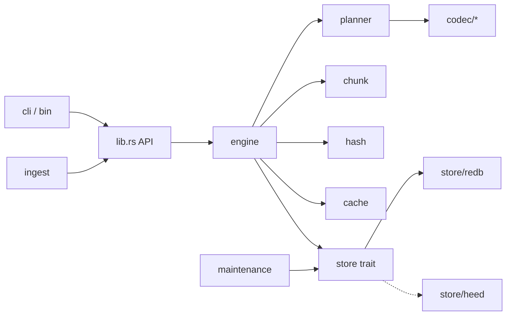

# BabelDB local — especificação de projeto

Estado em 27/09/2026: especificação, nenhum motor Rust implementado. Baseia-se na pesquisa de 26/09/2026. O que foi reexecutado hoje está marcado como [medido hoje]; o resto é [anterior], [hipótese] ou [meta].

## 0. Status da evidência

| item | classe | detalhe |
| --- | --- | --- |
| Bijeção afim sobre 2 bytes (65.536 seeds distintas, todas invertidas) | **[medido hoje]** | Python 3.12.10, `Hi` → seed `db48` |
| Casos de borda n ∈ {0,1,3,16,128,4096}, zeros, `ff`, aleatórios | **[medido hoje]** | roundtrip exato |
| Tamanhos Zstd/receita dos payloads de 4.096 B | **[anterior]** | zstandard 0.25.0 / libzstd 1.5.7, nível 1; não reexecutado |
| Toolchain disponível na máquina | **[medido hoje]** | `rustc 1.97.1`, `cargo 1.97.1`; nada compilado ainda |
| Versões atuais de redb, heed, blake3, lz4_flex, zstd, num-bigint | **não verificado** | resolver com `cargo add` e fixar no `Cargo.lock` na etapa 1 |
| Inspeção de margostino/babeldb @ `e1a03805ab095b7950725f4de2b16e1133f7d954` | **[anterior]**, estática | não reinspecionado hoje; nenhum código Go incorporado |
| Qualquer latência/throughput de redb, LMDB ou do motor | **inexistente** | será produzido pelo benchmark da §11 |

## 1. O conceito, separado em três camadas

|  | enunciado |
| --- | --- |
| **Desejado** | Guardar uma descrição regenerável mínima e reconstruir os bytes exatos rapidamente, mesmo acima da RAM. |
| **Matematicamente possível** | Endereço reversível sem busca (bijeção). Descrição curta **somente** para dados com estrutura que o sistema conhece (receita, repetição, duplicata). Para dados arbitrários, a descrição tem ≥ o tamanho da entrada no pior caso. |
| **A medir** | Em que fração do corpus real existe estrutura explorável; o custo líquido (metadados, dicionários, páginas do backend); a latência p99 resultante. |

### 1.1 Papel de cada elemento de `hash → estado → seed → conteúdo`

| elemento | o que é | persistido? | onde entra na leitura |
| --- | --- | --- | --- |
| **chave** | nome da aplicação (`usuario/42`) | sim, em `records` | **ponto de entrada** — 1 lookup B+tree |
| **estado** | o manifesto: revisão, tamanho, lista de objetos/receita. É o que diz *quais* possibilidades existem no banco | sim | obtido pelo lookup da chave |
| **seed / receita** | descrição de um bloco: seed afim, parâmetros de gerador, corpo comprimido ou bruto | sim, em `objects` ou inline | decodificada |
| **hash (BLAKE3)** | identidade do conteúdo | sim, 32 B por objeto + índice | **não** está no caminho de leitura por chave; serve para deduplicar na escrita e para verificar integridade após decodificar |
| **conteúdo** | bytes reconstruídos | não (só cache limitado) | saída |

Caminho concreto de leitura: `chave → manifesto → objetos → decode → verify`. Um lookup por chave e N lookups por objeto (N = blocos que intersectam o intervalo; N=0 se inline). Não há etapa "hash → estado".

### 1.2 Limites (contagem)

- Valores de exatamente `n` bytes: `2^(8n)` possibilidades ⇒ um código fixo precisa de `k ≥ 8n` bits. Com códigos variáveis, pela desigualdade de Kraft, se algum valor ganha código mais curto, outro fica mais longo; o comprimento médio sobre entradas uniformes não cai abaixo de `8n`.
- Conjunto de `m` itens entre `N` possíveis: ≥ `⌈log2 C(N,m)⌉` bits de estado no pior caso, antes de chaves e versões. **Ter um gerador de tudo não diz o que pertence ao banco.**
- Seed de 64 bits + gerador fixo ⇒ ≤ `2^64` saídas; não cobre entradas longas arbitrárias. Força bruta não muda isso.
- Página Babel (3.200 símbolos, alfabeto 29): índice ideal `⌈3200·log2 29⌉ = 15.546 bits` (1.944 B). Cálculo, não medição de URL.
- Hash de 256 bits identifica/verifica, mas não reconstrói; uma tabela hash→bytes é armazenamento.
- **Contabilidade**: dicionário, modelo, template, seed fornecida pelo cliente ou arquivo remoto necessários à recuperação entram no tamanho total.

**Quando a seed é tão grande quanto a entrada:** sempre no `BabelPure` (por construção é uma bijeção de mesmo tamanho) e, no `Adaptive`, sempre que nenhum reconhecedor/compressor encontra estrutura — nesse caso o fallback é `Raw` (+ envelope).

## 2. Duas variantes (resultados sempre reportados separados)

| variante | persistido | propósito | não é |
| --- | --- | --- | --- |
| `BabelPure` | seed afim de `n` bytes + comprimento + versão do codec | demonstrar endereçamento reversível sem busca | compressão (ganho esperado = 0 ou negativo pelo envelope) |
| `Adaptive` | a menor representação exata válida entre receitas, `Raw`, LZ4, Zstd; referências compartilhadas | economia real com custo de leitura controlado | "Babel" no sentido estrito; não força permutação |

Modo por banco na criação (`Config::mode`), gravado em `meta`. Mistura por registro fica proibida no MVP para não contaminar a comparação.

## 3. Algoritmos

### 3.1 `BabelAffineV1` (sem busca)

```
n ≥ 1, M = 2^(8n), a = 5, b = 1, a⁻¹ = inverso de 5 mod M
encode: seed = ((x − 1) · a⁻¹) mod M      x = inteiro big-endian dos bytes
decode: x    = (a · seed + 1) mod M
n = 0: seed vazia (tratamento explícito)
```

Bijeção porque `a` é ímpar ⇒ invertível mod `2^k`. Construção didática própria, não o algoritmo do site, não criptografia.

**Implementação sem bigints genéricos no caminho quente** (refinamento da base; justificativa: evita alocação e divisão modular). Módulo `2^(8n)` = aritmética de bytes com descarte do carry final:

- `decode`: multiplicar um número de `n` bytes por 5 e somar 1 é uma passada linear em bytes (little-end first), O(n).
- `encode`: multiplicar por `a⁻¹ mod 2^(8n)` é O(n²) ingênuo. Alternativa O(n): **divisão exata por 5 em 2-ádicos**. Como `(x−1)` ≡ `5·seed (mod 2^(8n))`, recupera-se `seed` byte a byte a partir do menos significativo: `s_i = (r_i · inv5_mod256) mod 256`, onde `r` é o resíduo corrente após subtrair `5·s_i` com carry. `inv5 mod 256 = 205`.

```rust
// bytes big-endian; iteramos do fim (menos significativo) ao início
pub fn babel_decode(seed: &[u8], out: &mut Vec<u8>) {
    out.clear(); out.resize(seed.len(), 0);
    let mut carry: u16 = 1;                       // +b
    for i in (0..seed.len()).rev() {
        let v = seed[i] as u16 * 5 + carry;
        out[i] = v as u8; carry = v >> 8;
    }                                             // carry final descartado (mod M)
}

pub fn babel_encode(data: &[u8], seed: &mut Vec<u8>) {
    const INV5: u8 = 205;                         // 5*205 = 1025 ≡ 1 mod 256
    let n = data.len(); seed.clear(); seed.resize(n, 0);
    // r = x - 1  (mod M), processado com borrow
    let mut r: Vec<u8> = data.to_vec();
    let mut borrow = 1u16;
    for i in (0..n).rev() { let v = r[i] as i16 - borrow as i16;
        r[i] = v.rem_euclid(256) as u8; borrow = (v < 0) as u16; if borrow == 0 { break; } }
    // divisão exata 2-ádica por 5
    let mut carry: u16 = 0;                       // carry de subtrair 5*s já emitido
    for i in (0..n).rev() {
        let ri = (r[i] as i16 - carry as i16).rem_euclid(256) as u8;
        let under = (r[i] as u16) < carry;
        let s = ri.wrapping_mul(INV5);
        seed[i] = s;
        let prod = s as u16 * 5;                  // prod mod 256 == ri
        carry = (prod >> 8) + under as u16 + ((ri as u16) < (prod & 0xff)) as u16;
    }
}
```

O código acima é **esboço a validar** contra `num-bigint` (feature `babel-reference`) e contra os vetores Python; o oráculo de teste é a versão bigint, não este esboço. Vetor fixo: `48 69` ↔ `db 48`.

### 3.2 Reconhecedores do `Adaptive` (seed calculada, não buscada)

Cada reconhecedor é O(n), sem estado global, e só aceita se `decode(encode(x)) == x`.

| codec (id) | corpo | reconhecimento | geração |
| --- | --- | --- | --- |
| `RawV1` (0x01) | bytes | sempre | cópia |
| `RepeatV1` (0x02) | `period:u32` + motif | menor período via função de prefixo (KMP): `p = n − π[n−1]`, aceito se `n % p == 0` ou se o resto for prefixo do motif; limite `p ≤ 4096` | repetir motif até `raw_len` |
| `ArithmeticU64V1` (0x03) | `start:u64, step:u64, count:u64` (LE) | `n % 8 == 0`, `step = v1 − v0` wrapping? **não**: exigir `checked_add` sem overflow | laço com `checked_add` |
| `Lz4V1` (0x10) | bloco LZ4 independente | comprimir, aceitar se menor | `decompress_into` com `raw_len` |
| `ZstdV1` (0x11) | frame, `aux_id` = dicionário ou 0 | comprimir no nível configurado | decompress com limite `raw_len` |
| `BabelAffineV1` (0x20) | seed `n` B big-endian | só no modo `BabelPure` | §3.1 |
| `TemplatePatchV1` (0x30, posterior) | `template_id` + patches `(off,len,bytes)` | etapa 7 | aplicar patches |
| `GeneratedV1` (0x40) | `generator_id:u16, gen_version:u16, params` | **não reconhece**: só via `put_generated` | chamar gerador registrado |

### 3.3 Receita fornecida na escrita (`put_generated`)

```rust
pub trait Generator: Send + Sync {
    const ID: u16; const VERSION: u16;
    fn validate(&self, params: &[u8]) -> Result<u64 /*raw_len*/>;
    fn generate_range(&self, params: &[u8], off: u64, out: &mut [u8]) -> Result<()>; // acesso aleatório
}
```

Fluxo: valida params → calcula `raw_len` → gera em streaming para computar BLAKE3 (custo O(n) na escrita, uma vez) → grava manifesto `Generated{gen_id, ver, params, digest}`. Leitura de intervalo chama `generate_range` diretamente, sem materializar o todo. Geradores são código versionado do binário: o **tamanho do binário conta** na contabilidade (§11). Gerador desconhecido na abertura ⇒ erro, nunca bytes errados. Nenhum gerador depende de hora, plataforma ou PRNG não especificado; o primeiro será `ArithmeticU64` e um `CounterHashV1` (BLAKE3 em modo XOF sobre um contador), que também torna honesto o caso "pseudoaleatório com gerador conhecido".

### 3.4 Seletor

```
para cada bloco:
  candidatos = [Raw] + reconhecedores aplicáveis + [Lz4, Zstd]   (Adaptive)
             = [BabelAffine]                                    (BabelPure)
  custo(c) = 64 (envelope) + len(corpo) + custo_amortizado(aux)
  filtra c com decode_cost_estimado(c, n) ≤ orçamento  (tabela medida na etapa 4)
  escolhe menor custo; empate → menor custo de decodificação
  verifica roundtrip; falha → Raw + métrica `planner_fallback`
```

## 4. Stack

| camada | escolha | critério para trocar |
| --- | --- | --- |
| linguagem | Rust estável (1.97.1 disponível) | se o gargalo for I/O e não CPU, a linguagem importa pouco; C++ equivaleria; Python fica como oráculo |
| persistência | `redb`, durabilidade `Immediate` | trocar se o benchmark (etapa 8) mostrar heed/LMDB melhor em p99 de leitura na mesma durabilidade, ou RocksDB se escrita dominar |
| hash | `blake3` | — |
| compressão | `lz4_flex`, `zstd` | `lz4_flex` é Rust puro; `zstd` traz C via build — aceitar |
| bigints | `num-bigint` só como oráculo de teste | `rug` apenas se algum caminho de produção precisar de bigint (hoje nenhum) |
| testes/bench | `proptest`, `criterion`, harness próprio p/ percentis | — |

Critérios concretos da comparação: bytes alocados totais, p50/p95/p99 por operação, RSS, bytes lidos do disco, tempo de commit durável, complexidade de dependências nativas, recuperação após kill. Nenhum vencedor presumido.

## 5. Arquitetura



Responsabilidades e mapa de arquivos: mantidos como na base (§12 original), com três ajustes:

- `src/generator/mod.rs` + `src/generator/counter_hash.rs` (novo; §3.3).
- `src/codec/babel_affine.rs` contém o caminho O(n); `tests/babel_oracle.rs` compara com `num-bigint`.
- `src/store/mod.rs` define transação sobre **todas** as tabelas:

```rust
pub trait Store {
    type R<'a>: ReadTxn where Self: 'a;
    type W<'a>: WriteTxn where Self: 'a;
    fn read(&self) -> Result<Self::R<'_>>;
    fn write(&self) -> Result<Self::W<'_>>;
}
pub trait ReadTxn {
    fn record(&self, key: &[u8]) -> Result<Option<Manifest>>;
    fn object(&self, id: ObjectId) -> Result<Option<Vec<u8>>>;   // cópia (MVP)
    fn param(&self, id: u64) -> Result<Option<Vec<u8>>>;
}
pub trait WriteTxn: ReadTxn {
    fn candidates(&self, digest: &[u8;32], len: u32) -> Result<Vec<ObjectId>>;
    fn insert_object(&mut self, env: &[u8]) -> Result<ObjectId>;
    fn add_candidate(&mut self, digest: &[u8;32], len: u32, id: ObjectId) -> Result<()>;
    fn put_record(&mut self, key: &[u8], m: &Manifest) -> Result<()>;
    fn remove_record(&mut self, key: &[u8]) -> Result<Option<Manifest>>;
    fn meta_next(&mut self, counter: Counter) -> Result<u64>;     // falha em esgotamento
    fn commit(self) -> Result<()>;                                // durável
}
```

## 6. Formato persistido (versão de formato 1)

Arquivo único `data/babel.redb`. Tabelas:

| tabela | chave | valor |
| --- | --- | --- |
| `meta` | `&str` | `format_version:u32=1`, `mode:u8`, `next_object_id:u64`, `next_revision:u64`, `block_size:u32`, `generators:[(id,ver)]` |
| `records` | `&[u8]` (≤ 4 KiB) | `Manifest` serializado |
| `objects` | `u64` | envelope (§6.1) |
| `hash_candidates` | `[u8;32] ++ u32 len` | lista de `u64` (multimap) |
| `params` | `u64` | `kind:u8, version:u16, bytes` (dicionário/template) |
| `refcounts`, **refinamento** | `u64` | `u32` |
| `history` (off) | `key ++ 0x00-escaped ++ rev:u64 BE` | manifesto |
| `sources` (opcional) | `u64` | `SourceDescriptor` |

`refcounts` é um acréscimo à base: custa ~12 B/objeto + páginas; permite exclusão incremental. Mantida a GC exclusiva de verificação (`verify --deep`) para detectar deriva.

### 6.1 Envelope do objeto (64 B + corpo, LE)

| off | B | campo |
| --- | --- | --- |
| 0 | 4 | magic `BBO1` |
| 4 | 1 | codec_id (tabela §3.2, permanente) |
| 5 | 1 | codec_version |
| 6 | 2 | flags (desconhecida ⇒ erro) |
| 8 | 4 | raw_len |
| 12 | 4 | body_len |
| 16 | 8 | aux_id (0 = nenhum) |
| 24 | 32 | BLAKE3(raw) |
| 56 | 8 | reserved = 0 |
| 64 | var | body |

### 6.2 Manifesto (v1)

```
u8   manifest_version = 1
u64  revision
u64  logical_len
u8   kind: 0=Inline 1=Chunks 2=Generated 3=Tombstone
u8   has_source; [u64 source_id]
Inline:    envelope completo embutido (sem ir a `objects`)
Chunks:    varint count; count × (logical_end:u64, object_id:u64)   // 16 B/ref
Generated: u16 gen_id, u16 gen_ver, varint len, params, [u8;32] digest
```

Inline se `raw_len ≤ inline_max` (inicial 1 KiB, **[hipótese]**, a calibrar). Objetos inline não participam de deduplicação.

## 7. APIs

```rust
pub struct Db { /* store, config, cache, generators */ }
impl Db {
    pub fn open(path: &Path, cfg: Config) -> Result<Db>;
    pub fn put(&self, key: &[u8], val: &[u8], expected: Option<Revision>) -> Result<Revision>;
    pub fn put_generated(&self, key: &[u8], gen: GeneratorRef, params: &[u8], expected: Option<Revision>) -> Result<Revision>;
    pub fn get(&self, key: &[u8]) -> Result<Option<Vec<u8>>>;
    pub fn get_range(&self, key: &[u8], off: u64, len: u64) -> Result<Option<Vec<u8>>>;
    pub fn delete(&self, key: &[u8], expected: Option<Revision>) -> Result<bool>;
    pub fn import_file(&self, key: &[u8], path: &Path, src: Option<SourceDescriptor>) -> Result<Revision>;
    pub fn inspect(&self, key: &[u8]) -> Result<Option<Inspection>>;
    pub fn stats(&self) -> Result<Stats>;
    pub fn verify(&self, deep: bool) -> Result<VerifyReport>;
    pub fn compact(&mut self) -> Result<CompactReport>;   // &mut = exclusivo
}
```

Erros: `Format`, `Integrity{object_id}`, `RevisionConflict{expected, actual}`, `UnknownCodec`, `UnknownGenerator`, `LimitExceeded`, `IdExhausted`, `Io`.

## 8. Fluxos

**put**: validar limites → dividir em blocos fixos → *fora da txn*: BLAKE3 + seleção + roundtrip de cada bloco → txn escrita: conferir revisão → para cada bloco consultar `hash_candidates`, reler candidato, comparar bytes; igual ⇒ reutilizar + `refcount++`, senão inserir → decrementar refcounts do manifesto anterior (se sem histórico) → nova revisão → `put_record` → commit `Immediate` → retornar.

**get_range**: txn leitura → manifesto → busca binária em `logical_end` → copiar envelopes → fechar txn → decodificar, checar `raw_len` e digest → cachear bloco verificado → fatiar.

**update** = put com manifesto novo. **delete**: remove registro (ou grava `Tombstone` se histórico ligado), `refcount--`; objetos com 0 viram candidatos à remoção no mesmo commit (MVP: remoção imediata com seus candidatos de hash).

**import_file**: ler em buffers de `block_size`; blocos preparados em lotes de txns *só de objetos* (refcount provisório registrado numa tabela `pending_imports(import_id → [object_id])`); manifesto + `sources.last_successful_import` publicados numa única txn final. Cancelamento ⇒ `maintenance` remove objetos de `pending_imports` antigos. Importações serializadas no MVP.

**manutenção**: `verify --deep` (recalcula refcounts por varredura, decodifica tudo, confere digests) e `compact` (API de compactação do redb). Remover linhas não garante encolher o arquivo; o relatório mostra antes/depois.

## 9. margostino/babeldb

Commit analisado `e1a03805ab095b7950725f4de2b16e1133f7d954` (master, 12/02/2023), Apache-2.0, sem `NOTICE` no checkout — **[anterior]**, não revalidado hoje. Lá, "seed" = URL inicial de coleta; não há codec reversível.

| elemento | decisão |
| --- | --- |
| separação collector/engine/storage | **conceito reutilizado** → `ingest` / `engine` / `store` |
| `Source` (nome, local, atualização) | **adaptado** → `SourceDescriptor` opcional e compartilhado |
| CLI interativa | **adaptado** posteriormente → `cli/repl.rs` sobre comandos tipados |
| parsing separado da execução | **conceito** → comandos tipados; sem SQL |
| storage em mapa na RAM, varredura em `Select` | **descartado** |
| normalização HTML | **descartado** do caminho lossless |
| coleta HTTP/agendamento | extensão opcional futura |
| código Go | **nenhum trecho copiado**; se algum for portado, preservar licença e marcar modificações |

## 10. Etapas verificáveis

| # | entrega | condição de saída |
| --- | --- | --- |
| 0 | `benchdata/manifest.json` com cenários sintéticos explícitos (S1–S6 abaixo) | workload documentado |
| 1 | formato, `RawV1`, store redb, put/get/delete | persiste após reabertura; `cargo test` verde; `Cargo.lock` + `rust-toolchain.toml` = 1.97.1 |
| 2 | `BabelAffineV1` O(n) + oráculo `num-bigint` + vetores Python | proptest 10⁵ casos; exaustivo n≤2 |
| 3 | bench Raw × BabelPure | relatório de bytes alocados e p99 |
| 4 | Repeat, ArithmeticU64, LZ4, Zstd, seletor | roundtrip; overhead contado |
| 5 | dedupe + refcounts | colisão artificial (hash forçado via feature de teste) não troca conteúdo |
| 6 | intervalos, block size, cache limitado, `put_generated` | amplificação de leitura medida |
| 7 | dicionários/templates, manutenção | ganho líquido em conjunto de validação separado |
| 8 | backend heed | comparação equivalente |
| 9 | recuperação, > RAM, compat de formato | critérios §12 |
| 10 | CLI/REPL/bindings | custo da interface medido à parte |

Início: `cargo new babeldb --lib` num diretório vazio.

## 11. Benchmark

Cenários sintéticos (**hipóteses** até haver corpus real): S1 zeros/repetição, S2 sequências u64, S3 JSON/log gerado com template fixo e campos variáveis, S4 duplicatas 30 %, S5 alta entropia (BLAKE3-XOF), S6 já comprimido (arquivos `.zst`). Tamanhos 64 B…64 KiB; volumes 0,25× e 4× o orçamento de RAM (limitado via job object no Windows / cgroup no Linux).

Variantes obrigatórias: redb bruto; motor+Raw; motor+BabelPure; +LZ4; +Zstd; Adaptive sem e com dedupe; Adaptive com `put_generated` quando aplicável.

Métricas: p50/p95/p99, throughput, bytes lidos, CPU, RSS, page faults, bytes reconstruídos/byte pedido, commit durável. Tamanho aparente **e** alocado (`GetCompressedFileSizeW`/`st_blocks`).

```
total = seeds/receitas/corpos + envelopes + manifestos + índices
      + dicionários/templates + histórico + espaço livre interno
      + tamanho do binário atribuível a geradores/codecs + descrições mantidas pelo cliente
```

Registrar hardware, SO, FS, SSD, compilador, features, commit, `Cargo.lock`; repetições independentes; cache do SO documentado ("processo novo" ≠ "disco frio").

Expectativa **[hipótese]** derivada da §1: BabelPure ≥ Raw em bytes (envelope idêntico, corpo do mesmo tamanho) e latência de encode/decode O(n) adicional; qualquer economia virá do Adaptive.

## 12. Testes

roundtrip por codec; vazio/limites/todos os bytes/UTF-8; modelo vs `BTreeMap` com sequências proptest; colisão de hash forçada; kill antes/depois do commit (processo filho + reabertura; declarar que não simula queda de energia); leitores concorrentes × escritor; corpo truncado, dicionário ausente, flags desconhecidas; `tests/format_compat.rs` com arquivos `.redb` v1 congelados; gerador desconhecido.

Metas **[meta, negociáveis]**: 0 divergência de bytes; 0 commit confirmado perdido nos cenários testados; ≥ 20 % menos bytes alocados que motor+Raw com ≤ 10 % de regressão de p99 — senão publicar a curva espaço×latência.

## 13. Decisões em aberto (dependem de dados reais)

- block size (4/16/64 KiB) e `inline_max`;
- orçamento de latência que filtra codecs;
- se dicionários Zstd compensam (amortização);
- redb × heed × RocksDB;
- envelope compacto v2 para objetos pequenos (64 B pesa em valores de 64 B);
- se FastCDC, FSST ou Succinct entram (só se busca por conteúdo ou dedupe de arquivos deslocados for requisito);
- política sem `expected_revision` (proposta: last-writer-wins).
